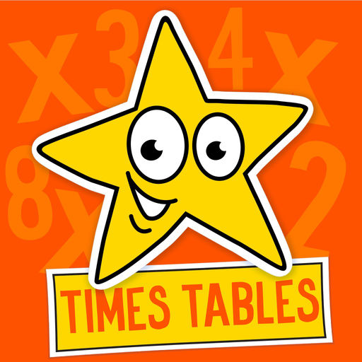
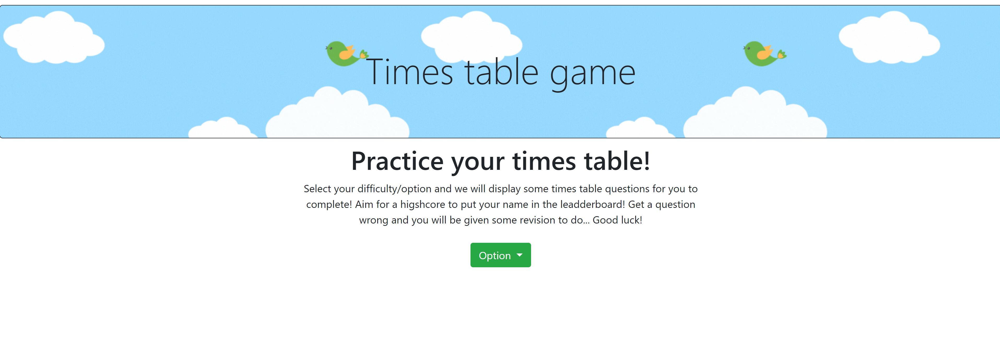
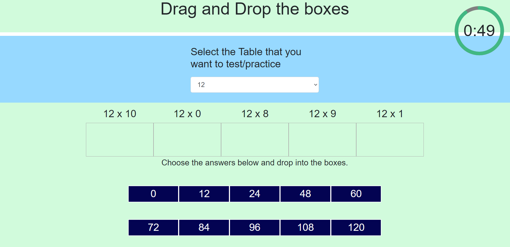
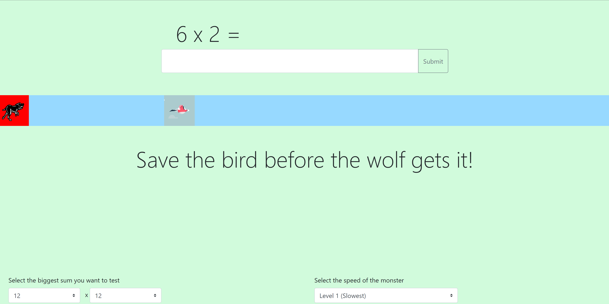
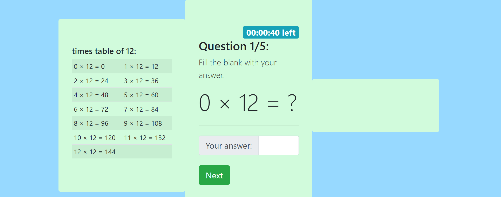
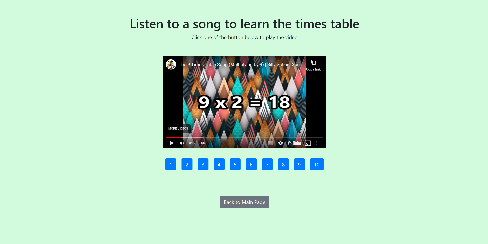

<!-- Improved compatibility of back to top link: See: https://github.com/othneildrew/Best-README-Template/pull/73 -->

<!--
*** Thanks for checking out the Best-README-Template. If you have a suggestion
*** that would make this better, please fork the repo and create a pull request
*** or simply open an issue with the tag "enhancement".
*** Don't forget to give the project a star!
*** Thanks again! Now go create something AMAZING! :D
-->

<!-- PROJECT SHIELDS -->
<!--
*** I'm using markdown "reference style" links for readability.
*** Reference links are enclosed in brackets [ ] instead of parentheses ( ).
*** See the bottom of this document for the declaration of the reference variables
*** for contributors-url, forks-url, etc. This is an optional, concise syntax you may use.
*** https://www.markdownguide.org/basic-syntax/#reference-style-links
-->
[![Contributors][contributors-shield]][contributors-url] [![Forks][forks-shield]][forks-url] [![Stargazers][stars-shield]][stars-url] [![Issues][issues-shield]][issues-url] [![MIT License][license-shield]][license-url]

<!-- PROJECT LOGO -->
 

  

<h3 align="center">Times Table Trainer</h3>

  

    A website for kids to practice and test their times table memorization.
     
    <a href="https://github.com/nrprabhav/Group-Project"><strong>Explore the docs »</strong></a>
     
     
    <a href="https://github.com/nrprabhav/Group-Project">View Demo</a>
    ·
    <a href="https://github.com/nrprabhav/Group-Project/issues">Report Bug</a>
    ·
    <a href="https://github.com/nrprabhav/Group-Project/issues">Request Feature</a>
  

<!-- TABLE OF CONTENTS -->

  
Table of Contents

  <ol>
    <li>
      <a href="#about-the-project">About The Project</a>
      <ul>
        <li><a href="#built-with">Built With</a></li>
      </ul>
    </li>
    <li><a href="#features-of-the-page">Features of the Page</a></li>
    <li><a href="#future-work">Future Work</a></li>
    <li><a href="#contributions">Contributions</a></li>
    <li><a href="#license">License</a></li>
    <li><a href="#contact">Contact</a></li>
    <li><a href="#acknowledgments">Acknowledgments</a></li>
  </ol>

<!-- ABOUT THE PROJECT -->
## About The Project

[![Time Table Trainer Screen Shot][product-screenshot]](./assets/Times-table-game.gif)

This is a website with different tools for kids to learn their times table. A variety of games are given to engage the attention of the kids.

(<a href="#readme-top">back to top</a>)

### Built With

* [![Bootstrap][Bootstrap.com]][Bootstrap-url]
* [![JQuery][JQuery.com]][JQuery-url]
* [![Svelte][youtube.dev]][youtube-url]
* [![GiPhy][giphy.com]][giphy-url]
* [![Canva][canva.com]][canva-url]

(<a href="#readme-top">back to top</a>)

<!-- Features of the Page -->
### Features of the Page
1. The home page offers the user an option of choosing to play several games or learn the times table using Youtube (API) videos
2. Several games are offered:
    a. Save the bird Animation game with speed control
    b. Drag and Drop game with learning mode and testing mode
    - A countdown timer in the testing mode

    c. Fill in the blanks
    - Reward badges are given on completion of game - badges have four friendly mascots: cat, dog, rabbit and hamster.
    - Three levels of difficulty
    - A countdown timer
    - Sound prompt along with the timer

    d. Times table quiz game

<!-- USAGE EXAMPLES -->
## Usage

#### Homepage

#### Drag and Drop Game

#### Save Bird Game

#### Fill in The Blank Game

#### Revision Videos Page

(<a href="#readme-top">back to top</a>)

<!-- CONTRIBUTING -->
## Contributions

This website was developed by a team of developers as below

- [Bilaal Kulane](https://github.com/bilaalgithub)
  Bilaal worked on the countdown timer for the drag-drop game
- [Maisie Truong](https://github.com/mtruong1995)
  Maisie created the homepage, linked the pages together and worked on styling to follow a theme.
- [Prabhav Reddy](https://github.com/nrprabhav)
  Prabhav took a lead in making the 
  - drag-drop game, 
  - save the bird game, and 
  - video song page
- [Ranjana Kumar](https://github.com/kumarranjana)
  Ranjana designed the multiple choice quiz game
- [Weilong Wang](https://github.com/V7lanw)
  Weilong took a lead in making the:
  - blank filling game, and
  - adding the GIPHY api

(<a href="#readme-top">back to top</a>)

<!-- ROADMAP -->
## Future Work

- [ ] Learning Path
      A learning path for children starting from simple counting all the way up
- [ ] Tracking
      Implementing a way to track user's progress and remember it over sessions
- [ ] Sound
      Add sounds to the games to improve engagement
- [ ] Do extensive testing to locate bugs in the code
- [ ] New games and other Features

See the [open issues](https://github.com/nrprabhav/Group-Project/issues) for a full list of proposed features (and known issues).

(<a href="#readme-top">back to top</a>)

<!-- LICENSE -->
## License

Distributed under the MIT License. See `LICENSE.txt` for more information.

(<a href="#readme-top">back to top</a>)

<!-- CONTACT -->
## Links to the Project

Project Link: [https://github.com/nrprabhav/Times-Table-Trainer](https://github.com/nrprabhav/Times-Table-Trainer)

Deployed Link: [https://nrprabhav.github.io/Times-Table-Trainer/](https://nrprabhav.github.io/Times-Table-Trainer/)

(<a href="#readme-top">back to top</a>)

<!-- ACKNOWLEDGMENTS -->
## Acknowledgments

* Thanks to Drew Hoang and Austin Imbastari for teaching and supporting us.
* [Fantastic-pudding](https://fantastic-pudding.vercel.app/)
* [Bootstrap](https://getbootstrap.com/)

(<a href="#readme-top">back to top</a>)

<!-- MARKDOWN LINKS & IMAGES -->
<!-- https://www.markdownguide.org/basic-syntax/#reference-style-links -->
[contributors-shield]: https://img.shields.io/github/contributors/nrprabhav/Group-Project.svg?style=for-the-badge
[contributors-url]: https://github.com/nrprabhav/Group-Project/graphs/contributors
[forks-shield]: https://img.shields.io/github/forks/nrprabhav/Group-Project.svg?style=for-the-badge
[forks-url]: https://github.com/nrprabhav/Group-Project/network/members
[stars-shield]: https://img.shields.io/github/stars/nrprabhav/Group-Project.svg?style=for-the-badge
[stars-url]: https://github.com/nrprabhav/Group-Project/stargazers
[issues-shield]: https://img.shields.io/github/issues/nrprabhav/Group-Project.svg?style=for-the-badge
[issues-url]: https://github.com/nrprabhav/Group-Project/issues
[license-shield]: https://img.shields.io/github/license/nrprabhav/Group-Project.svg?style=for-the-badge
[license-url]: https://github.com/nrprabhav/Group-Project/blob/master/LICENSE.txt
[linkedin-shield]: https://img.shields.io/badge/-LinkedIn-black.svg?style=for-the-badge&logo=linkedin&colorB=555
[linkedin-url]: https://linkedin.com/in/linkedin_username
[product-screenshot]: ./assets/Times-table-game.gif
[Next.js]: https://img.shields.io/badge/next.js-000000?style=for-the-badge&logo=nextdotjs&logoColor=white
[Next-url]: https://nextjs.org/
[React.js]: https://img.shields.io/badge/React-20232A?style=for-the-badge&logo=react&logoColor=61DAFB
[React-url]: https://reactjs.org/
[Vue.js]: https://img.shields.io/badge/Vue.js-35495E?style=for-the-badge&logo=vuedotjs&logoColor=4FC08D
[Vue-url]: https://vuejs.org/
[Angular.io]: https://img.shields.io/badge/CSS3-DD0031?style=for-the-badge&logo=css3&logoColor=white
[Angular-url]: https://angular.io/
[youtube.dev]: https://img.shields.io/badge/Youtube-4A4A55?style=for-the-badge&logo=youtube&logoColor=FF3E00
[youtube-url]: https://youtube.com/
[GiPhy.com]: https://img.shields.io/badge/GIPHY-FF2D20?style=for-the-badge&logo=giphy&logoColor=white
[GiPhy-url]: https://giphy.com/
[Bootstrap.com]: https://img.shields.io/badge/Bootstrap-563D7C?style=for-the-badge&logo=bootstrap&logoColor=white
[Bootstrap-url]: https://getbootstrap.com
[JQuery.com]: https://img.shields.io/badge/jQuery-0769AD?style=for-the-badge&logo=jquery&logoColor=white
[JQuery-url]: https://jquery.com 
[canva.com]:https://img.shields.io/badge/Canva-%2300C4CC.svg?style=for-the-badge&logo=Canva&logoColor=white
[canva-url]: https://www.canva.com/